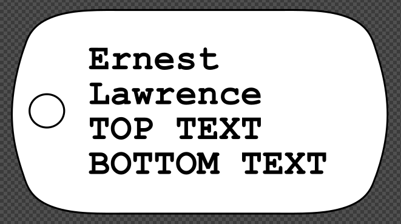

# Dogtags

A bash script that generates SVG files of dog tags from a template file and a list of names. These files are meant to be cut and etched on a laser cutter.



## Requirements

- inkscape

## Setup

Change `TOPTEXT` and `BOTTOMTEXT` variables in the script to your liking.

## Usage

```sh
$ ./dogtags names.txt
```

`names.txt` is a newline separated list of names. Output will be in the `/output` directory. Files will be named according to the name of each person.